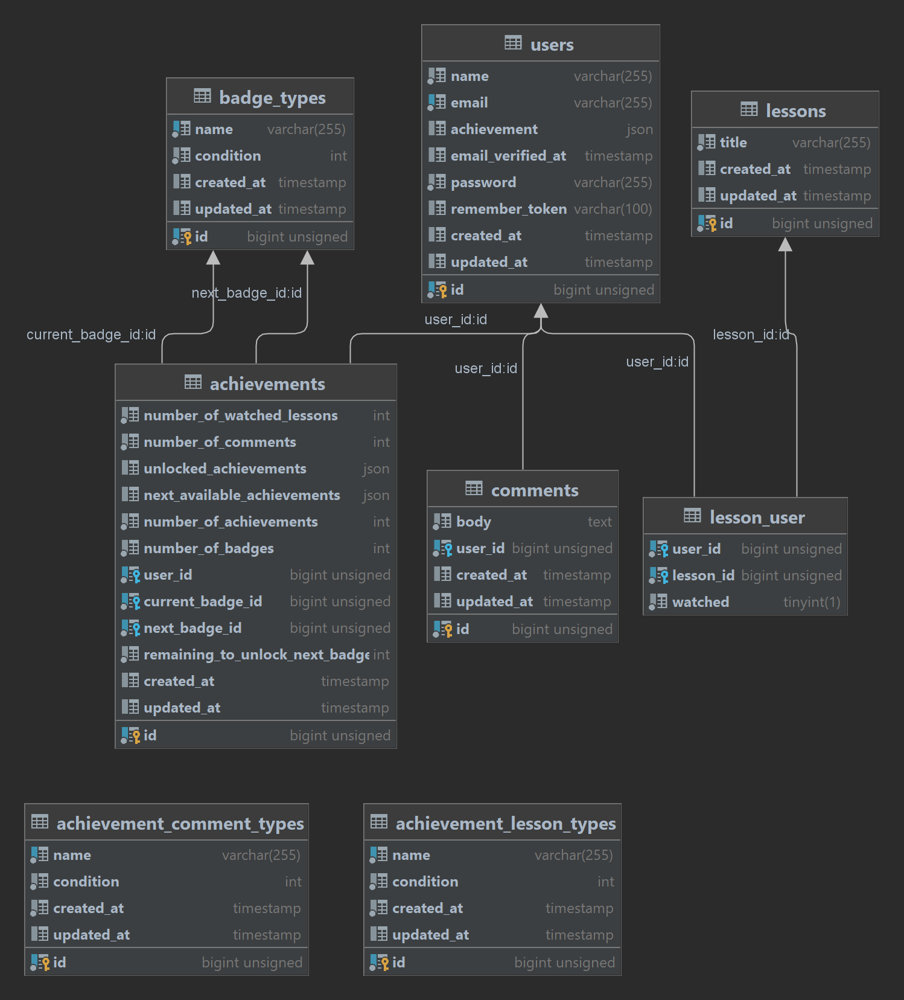

# Achievement Tracker API

Achievement Tracker API is a Laravel-based application that manages user achievements, comments, and lesson tracking. This RESTful API provides endpoints for user authentication, achievement retrieval, comment creation, and lesson tracking functionalities.

## Table of Contents

- [Installation](#installation)
- [Usage](#usage)
- [Diagram](#license)
- [Endpoints](#endpoints)
- [Controllers](#controllers)
- [Routes](#routes)
- [Contributing](#contributing)


## Installation

To set up and run this application locally, follow these steps:

1. Clone the repository:

    ```bash
    git clone https://github.com/amremaish/achievement-tracker-api.git
    ```

2. Navigate to the project directory:

    ```bash
    cd achievement-tracker-api
    ```

3. Install dependencies using Composer:

    ```bash
    composer install
    ```

4. Set up the environment variables by creating a `.env` file. Use the `.env.example` file as a reference:

    ```bash
    cp .env.example .env
    ```

   Update the necessary configurations like the database connection details.

5. Generate an application key:

    ```bash
    php artisan key:generate
    ```

6. Run the database migrations:

    ```bash
    php artisan migrate
    ```

7. Serve the application:

    ```bash
    php artisan serve
    ```

## Usage

The Achievement Tracker API offers various endpoints to interact with the system. You can use tools like Postman or any HTTP client to access these endpoints.

Ensure you have appropriate authentication credentials (JWT token) for accessing protected endpoints.
## Diagram



This diagram represents the structure of the database used in the Achievement Tracker API.


## Endpoints

### Authentication

- `POST /api/auth/login`: Log in and obtain a JWT token.
    ```bash
    curl --location 'http://127.0.0.1:8000/api/auth/login' \
    --header 'Content-Type: application/json' \
    --data-raw '{
        "email": "user123@example.com",
        "password": "123456"
    }'
    ```

- `POST /api/auth/signup`: Register a new user.
    ```bash
    curl --location 'http://127.0.0.1:8000/api/auth/signup' \
    --header 'Content-Type: application/json' \
    --data-raw '{
        "name" :"user",
        "email": "user123@example.com",
        "password": "123456"
    }'
    ```

- `POST /api/auth/logout`: Log out and invalidate the token.

- `POST /api/auth/refresh`: Refresh the token.

### Achievements and User

- `GET /api/user`: Get user details.
    ```bash
    curl --location 'http://127.0.0.1:8000/api/user' \
    --header 'Authorization: Bearer YourToken'
    ```

- `GET /api/users/{user}/achievements`: Retrieve user achievements.
    ```bash
    curl --location 'http://127.0.0.1:8000/api/users/1/achievements' \
    --header 'Authorization: Bearer YourToken'
    ```

- `POST /api/comments/create`: Create a new comment.
    ```bash
    curl --location --request POST 'http://127.0.0.1:8000/api/comments/create' \
    --header 'Content-Type: application/json' \
    --header 'Authorization: Bearer YourToken' \
    --header 'Accept: application/json'
    ```

- `POST /api/lessons/{lessonId}/watch`: Mark a lesson as watched.
    ```bash
    curl --location --request POST 'http://127.0.0.1:8000/api/lessons/11/watch' \
    --header 'Content-Type: application/json' \
    --header 'Accept: application/json' \
    --header 'Authorization: Bearer YourToken'
    ```

For detailed information on request and response formats, refer to the API documentation or explore the codebase.

## Controllers

- `AuthController`: Manages user authentication (login, signup, logout, token refresh).
- `AchievementsController`: Retrieves and manages user achievements.
- `CommentController`: Handles comment creation.
- `LessonController`: Manages lesson tracking functionalities.

Each controller provides specific functionalities related to the corresponding domain.

## Routes

The `api.php` file contains the API routes registered by the application. These routes map HTTP methods to the appropriate controller methods and define the API structure.

## Contributing

Contributions to this project are welcome! If you find any issues or have suggestions for improvements, feel free to open an issue or create a pull request. Please follow the contribution guidelines provided in the repository.


